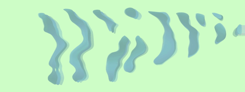
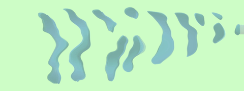
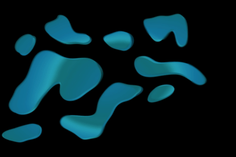
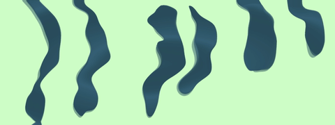

# WIF Fronds

Generative visual variations used as part of the [Photo Arc](../) exhibit — attractor-driven fronds, stripes, speckles, and blue-stripe patterns.

| Fronds | Stripes | Speckles | Blue Stripes |
|---|---|---|---|
|  |  |  |  |

## Files

- `WIF_Fronds.toe` / `WIF_Fronds_crop.toe`
- `WIF_Stripes1.toe` / `WIF_Stripes1_crop.toe` / `WIF_Stripes_full.toe`
- `WIF_Speckles1.toe` / `WIF_Speckles1_crop.toe` / `WIF_Speckles2_full.toe`
- `WIF_BlueStripes_crop.toe`

## Requirements

- [TouchDesigner](https://derivative.ca/) (macOS)
